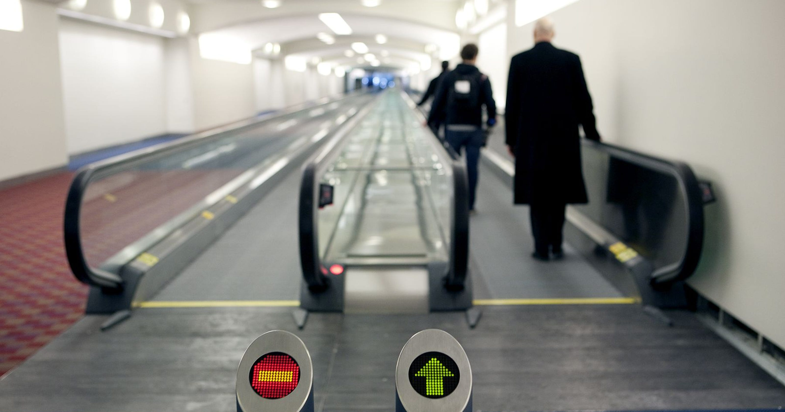
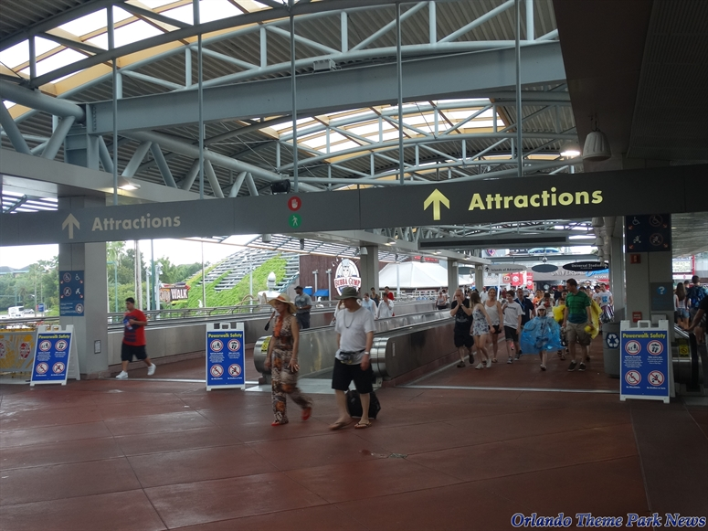
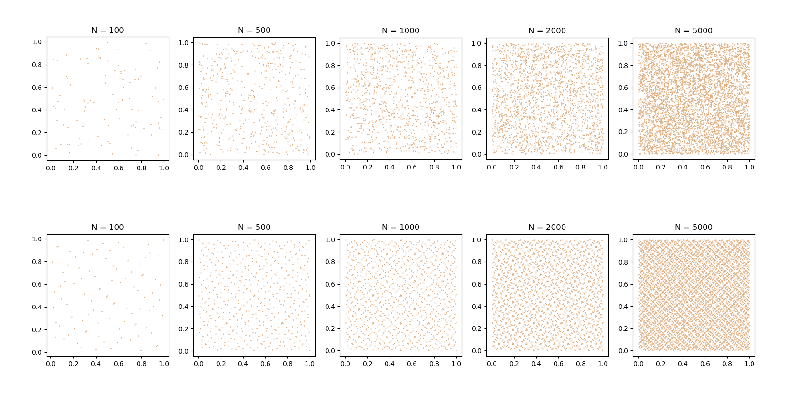
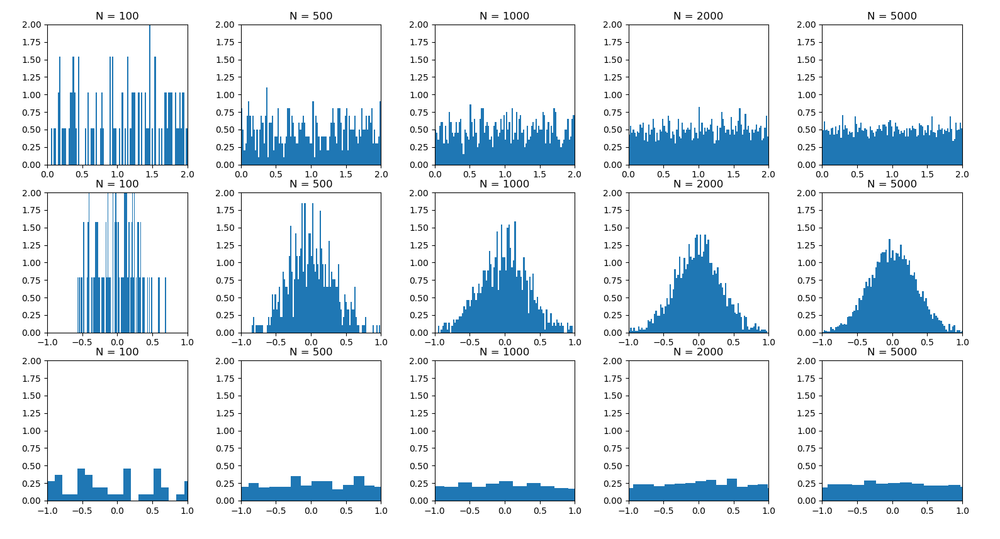
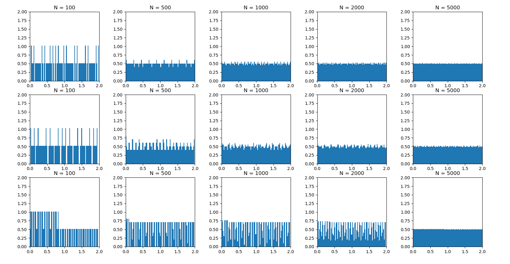

# Assignment 1 - Designing Models and Analyzing Data

> * Participant name: John "The King" Sermarini
> * Project Title: Simulation of Moving Walkways in United States Subway Systems

# General Introduction

The first part of this assignment explores designing models (and basic Python/Git features). 

We will look at **subway model in a city** system. A **subway system** is an underground, tube, or metro, underground railway system used to transport large numbers of passengers within urban and suburban areas - modern subways use different types of electronic data collection sensors to supply information which is used to manage assets and resources efficiently. 

The second part of the assignment explores data analysis. Data analysis and visualization is key to both the input and output of simulations. This assignment explores different random number generators, distributions, visualizations, and statistics. Additionally, it will look at getting you accustomed to specifying input and output variables to a system. We will also practice working with real data.

# Part 1: Designing a Model - Subway System

We are looking at the issue of the improving the efficiency of subway systems in the United States by introducing moving walkways to densely populated subway routes. By improving passenger movement speed, we can reduce overall time passengers spend underground which will lead to reduced congestion.

Currently, moving walkways in the United States are found mostly in airports and amusement parks, and are seldom seen within subway stations. They are more common internationally, with some notable examples being the London Underground's Bank Station and multiple stations on Hong Kong's MTR. 

Although the first commerical moving walkway was in a Jersey City railroad station, many moving walkways at United States transit stations have either been removed or do not recieve suitable maintence from subway employees. 

## (Part 1.1): Requirements (Experimental Design) **(10%)**

Our model is designed to test the impact of introducing moving walkways into subway stations and measuring their impact on passenger throughput. Our objective is to create a model that will reduce passenger travel time enough to justify the cost of implementing and maintaining these walkways. We theorize that the introduction of the moving walkways will decrease average total spent by passenegers in subway stations by increasing their movemeent speed, but at the cost of increased maintenece costs incured by the station.

Requirements:
* The model shall decrease average total time passengers spend at the subway station by a minimum of 10%.
* The total cost of the system shall be within the budget of the station. 

## (Part 1.2) Subway Moving Walkway Model **(10%)**

* [**Object Diagram**](model/object_diagram.md) - provides the high level overview of components
* [**Class Diagram**](model/class_diagram.md) - provides details of (what are you providing details of)
* [**Behavior Diagram**](model/behavior_diagram.md) - provides details of (what are you providing details of)

## (Part 1.3) Subway Moving Walkway Simulation **(10%)**

We plan to simulate this model using **Python**. We have chosen this method because recreating our classes and methods in it will be incredibly easy using Python's expansive user created libraries and tool kits.  The simulation will be a discrete simulation depicting passenger objects transitions between states of walking on walkways, walking off walkways, being idle, etc...

To help define a set of requirements and identify how our model can be tested and improved, we have decided to break it down into seperate groups of inputs and outputs. We plan to test a variety of different walkway and passeneger configurations to reached our desired outcome.

Inputs:
* Number of passengers
* Passenger routes
* Moving walkway positions
* Number of moving walkways
* Length of moving walkways
* Width of moving walkways
* Speed of moving walkways
* Moving walkway style (is the right side reserved for standing?)

Outputs:
* Total time spent by passengers by route
* Total cost of implementation

## (Part 1.4) Subway Moving Walkway Model **(10%)**
[**Code**](code/README.md) - Starting coding framework for the Subway Moving Walkway Model.

## (Part 1.5) Specifying the Inputs to a System **(10%)**

To create an accurate and effective model, we must implement real world data. We could manually collect data by tracking information a particular subway station. This can include the paths the passengers take, passenger quantity at different times of the day, and travel length of the different routes. If possible, we could use data colleted during previous studies or just look at the general flow of the population in the city the station is located in. Looking at mean travel times would be ideal as it can be easily measured and useful in determining how effective our model actually is at reducing travel time.

Visualization of our model would be helpful, but the most important part is the data regarding travel times. We could create a Python GUI or 3D simulation showing passengers moving around if it was deemed essential. A more effective means of determining our model's usefullness would be through visualization of data using graphs. Line, scatter, or raincloud plots could show the movement time reduction of different configurations of the system along with that configuration's cost of implementation. When the most efficient and effective walkway configuration is found, an infographic could be created to show the population how it would reduce travel time and what it would look like when implemented.

Independant Variables:
* Passengers
	* Quantity
	* Route traveled
	* Speed
* Walkways
	* Quantity
	* Length
	* Width
	* Speed
	* Style 

Dependant Variables:
* Cost of implementation
* Total travel time for passenegers

# Part 2: Creating a Model from Code

## (Part 2.1) **P**ortable **O**rganic **T**rouble-free **S**elf-watering System (**POTS**) Model **(10%)**
Here [**we provide an overview**](code/POTS_system/README.md) of the **P**ortable **O**rganic **T**rouble-free **S**elf-watering System (**POTS**) Model and provide a source code template for the code found in  [**the following folder**](code/POTS_system/).

# Part 3: Data Analysis

## (Part 3.1) - Real Data **(10%)**

Find a datasource that looks at part of this model - subway stations locations / escalator number, heights, widths / volume of passangers - ridership numbers   (*fits* - we are pretty loose here, it can be anything.)

https://catalog.data.gov/dataset/subway-entrances

* Write up a paragraph that describes the data and how it fits into your system.
* Load the data into Python
* Calculate a few useful statistic on the data - keep it simple- STD, means, etc..., this is just designed * to get used to working with real data. Explain the insights you derive from these statistics.
* Visualize the raw data - visualize a few critical aspects of the data to better describe what it is, what it is showing, and why its useful to your system.
* Calculate and plot some summary statistics that better describe the data.

(Add your plots and visualization here)
(Put your data into the data directory)

## (Part 3.2) -  Plotting 2D Random Number Generators **(15%)**

The top row shows the psuedo random number sand the bottom shows the quasi random numbers. The psuedo random numbers were generated using numpy's **rand()** function, and the quasi random numbers were generated using Sobol Sequences from the library linked below. The most notable difference between the two methods is the clear pattern exhibited by the quasi random method. The sequence has an almost intentional textured look, while the psuedo random numbers seem to not follow any set pattern.

* Python Sobol Sequences : https://pypi.org/project/sobol_seq/

## (Part 3.3) -  Plotting 1D Random Distributions **(15%)**

The following graphs were generated using different psuedo random number methods, all taken from the **Numpy** library. The top row uses **Uniform** distribution, the middle **Normal** distribution, and the bottom **Logistic** distribution. We can see that as N increases, the graphs increasingly resemble how the distributions are supposed to look. Uniform becomes more equal, Normal becomes more normally distributed, and Logistic becomes more flat.

The following graphs were generated using different quasi random number methods. The top row was generated using the **Sobol** sequence using the same library from part 3.2. The middle row was generated using the **Halton**, taken from the library below. The bottom row uses the same **Halton** sequence as the middle row, just using different dimensions. We can see that as N increases, the histograms maintain their quasi random patters, but they become more uniformally distributed.

* Python Sobol Sequences : https://pypi.org/project/sobol_seq/
* Halton Sequence: https://pypi.org/project/ghalton/

Note: Axis labels are a little wonky. The data is legit, but I had to work a little trickery to make the graphs appear square and uniform.