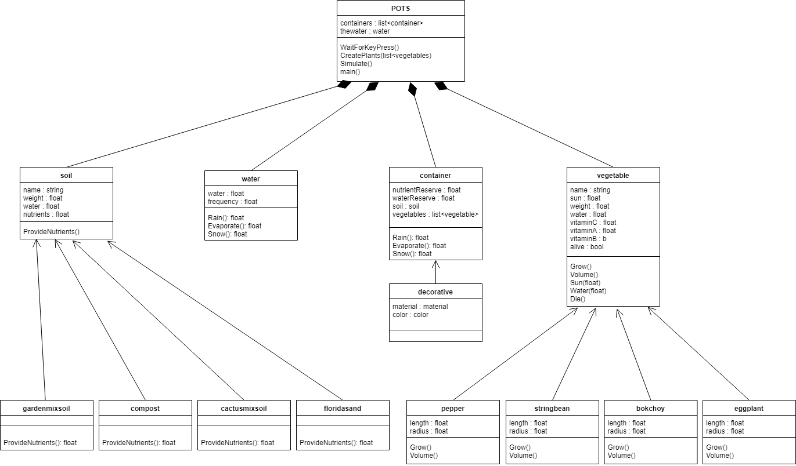

## **P**ortable **O**rganic **T**rouble-free **S**elf-watering System (**POTS**) Model

The Portable Organic Trouble-free Self-watering System (POTS) model is a system used to simulate the effect that different types of potting soil will have on different types of vegetables.

