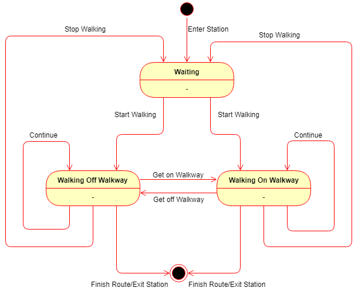

## Subway Walkway Model - Behavior Diagram

As the movement of passengers is the most important element in the model, we have created a state diagram to show how their behavior will be simulated. Upon entering the station, the passenger will be in a waiting state. When the passenger decides to start walking their route, they will enter a walking state. If they have previously entered a walkway, they will walk on the walkway, which provides a boost to their base movement speed. They can freely transition between being on the walkway, off the walkway, and back to idle. When a passenger is in the walking state, if they reach the end of their route, they exit the station and cease being useful to our simulation.

