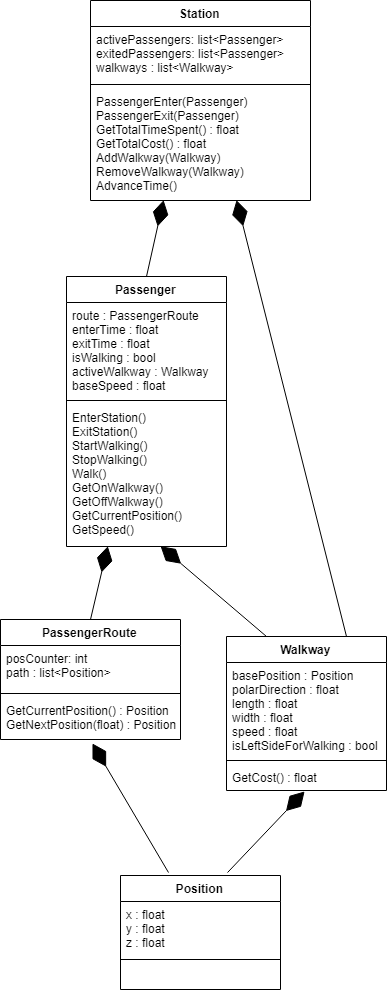

## Subway Walkway Model - Class Diagram

(remove: provide a description of the current model you describe below)

This model shows how the passengers in the simulation move and the data that is being tracked. As passengers "enter the station" (aka spawned), they are added to an active passengers list. Every frame, time is advanced and passengers move along as at speed that is calculated according to their base speed and speed of the walkway they are on if they are on one. They follow a set route that is determined on passenger spawn. Upon reaching the end of their path, passengers are removed from the active list and added to the exited (inactive) list. Walkways are added by passing in a position and a polar angle value that is then modded by 360 degrees. Their estimated total cost is calculated according to the length and width of the path.

