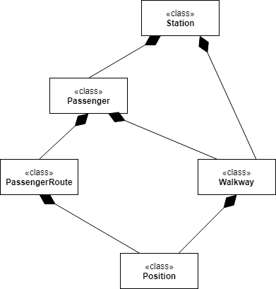

## Subway Walkway Model - Object Diagram

This model shows how the different objects within the system will be organized. The **Station** class represents the subway station and contains all other elements of the system within it. The people in the subways station are represented by the **Passenger** class. Passenegers travel along paths represented by **PassengerRoute** and on top of walkways represented by **Walkway**. **Position** is used to track where along along the route and within the station the passeneger is, which helps track how effective the walkways are at speeding up movement.

